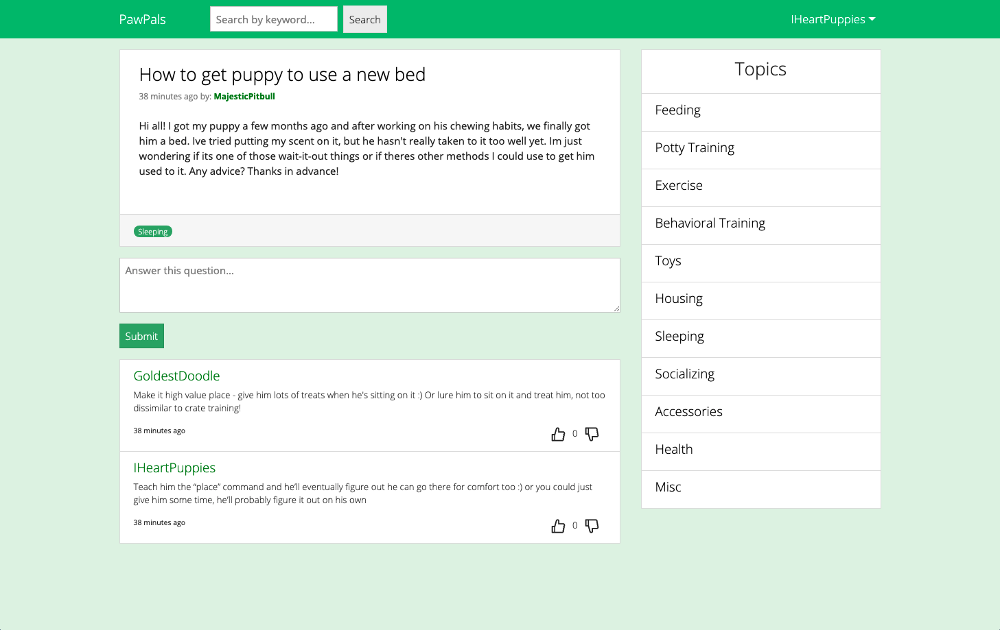
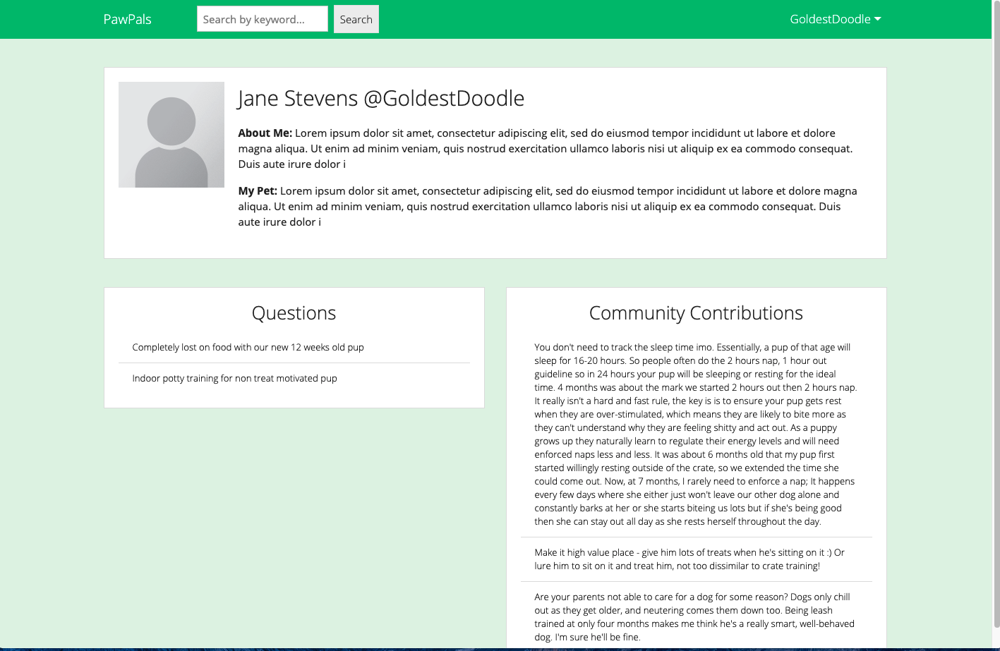

# PawPals

## Overview

https://pawpals100.herokuapp.com/

This application serves a social media site where pet owners can post their pet related questions for the online community to help with and answer other users questions

## Table of Contents
    
* [UserStory](#UserStory)
* [Usage](#usage)
* [ScreenShots](#Screenshots)
* [License](#license)
* [Badges](#badges)

## User Story
AS a pet owner
I WANT an online community dedicated to pets
SO THAT I can ask questions about my pet
AND answer other users questions

## Usage 

The user is presented with the home page where they can browse the latest questions asked. They can also browe by searching questions by keyword and browsing by topic which can be found on the sidebar. If the user wants to ask a question, they must first register and login with their new account. They will be redirect to the homepage where they can press the 'Ask a question' button and a modal will appea with a form they can fill out to ask their question. The user can also answer other users questions by clicking on the title of a post. They can also vote on whether answers and helpful or unhelpful by using the upvote and downvote buttons on the comments. 

Each user also has their own profile in where they can display their name and add a bio for themselves and their pets. This profile will also display the questions they've asked and the comments they've made. The user can view any user profile by clicking the username displayed in user posts or comments. 

## Screenshots

## License
    
MIT License

Copyright (c) 2020 Christine Ross
        
Permission is hereby granted, free of charge, to any person obtaining a copy
of this software and associated documentation files (the "Software"), to deal
in the Software without restriction, including without limitation the rights
to use, copy, modify, merge, publish, distribute, sublicense, and/or sell
copies of the Software, and to permit persons to whom the Software is
furnished to do so, subject to the following conditions:
        
The above copyright notice and this permission notice shall be included in all
copies or substantial portions of the Software.
        
THE SOFTWARE IS PROVIDED "AS IS", WITHOUT WARRANTY OF ANY KIND, EXPRESS OR
IMPLIED, INCLUDING BUT NOT LIMITED TO THE WARRANTIES OF MERCHANTABILITY,
FITNESS FOR A PARTICULAR PURPOSE AND NONINFRINGEMENT. IN NO EVENT SHALL THE
AUTHORS OR COPYRIGHT HOLDERS BE LIABLE FOR ANY CLAIM, DAMAGES OR OTHER
LIABILITY, WHETHER IN AN ACTION OF CONTRACT, TORT OR OTHERWISE, ARISING FROM,
OUT OF OR IN CONNECTION WITH THE SOFTWARE OR THE USE OR OTHER DEALINGS IN THE
SOFTWARE.
    
## Badges
    
